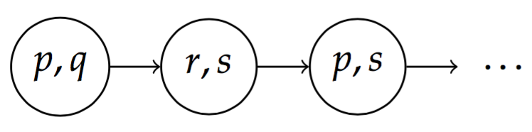

# Creating LTL paths

For my Master's thesis, I have to discuss Linear Temporal Logic (LTL),
which has a *path*-based semantics: A *path* is understood as a sequence
of *states*, where each state is a snapshot of time where certain
propositions are true. The paths stretch infinitely into the future.To
illustrate such paths, we can employ the TikZ package and the Automata
package. Here is a short example:

```latex
\usepackage{tikz}
\usetikzlibrary{automata}
\begin{tikzpicture}[->, auto, node distance=1.5cm, line width=0.2mm]
    \node[state] (A)                {$p, q$};
    \node[state] (B) [right of=A]   {$r, s$};
    \node[state] (C) [right of=B]   {$p, s$};
    \node[state, draw=none] (D) [right of=C]   {\ldots};

    \path (A) edge node {} (B)
          (B) edge node {} (C)
          (C) edge node {} (D);
\end{tikzpicture}
```

This is the result:



The key to note here is that we use `draw=none` to create a hidden state
containing the ellipsis.

I learned about TikZ from [@veleda](https://github.com/veleda)s amazing
[TikZ course](https://github.com/veleda/TikZ), which is highly recommended for
all Norwegian-speaking LaTeX users!
